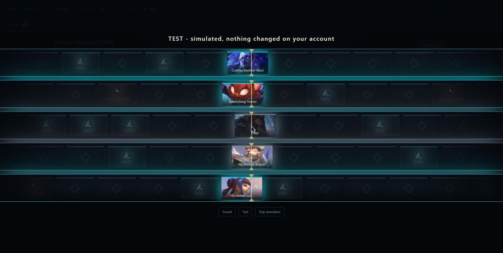
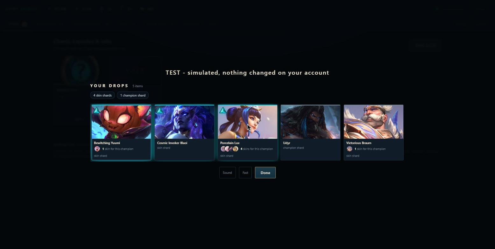
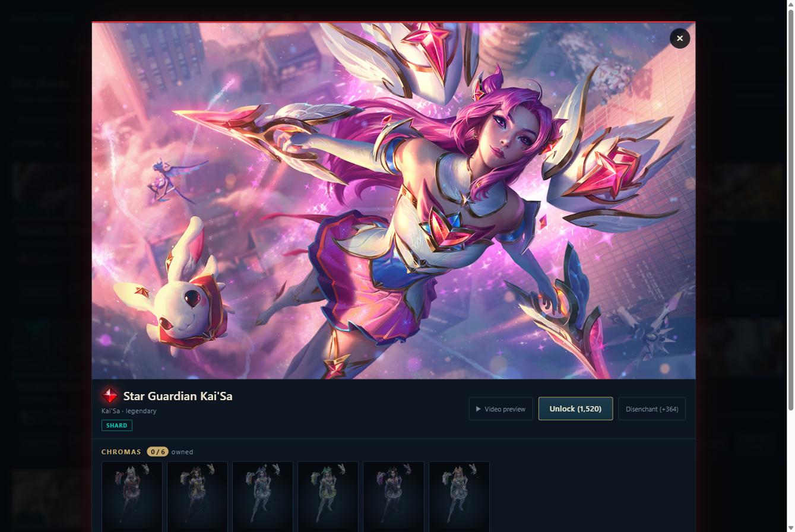
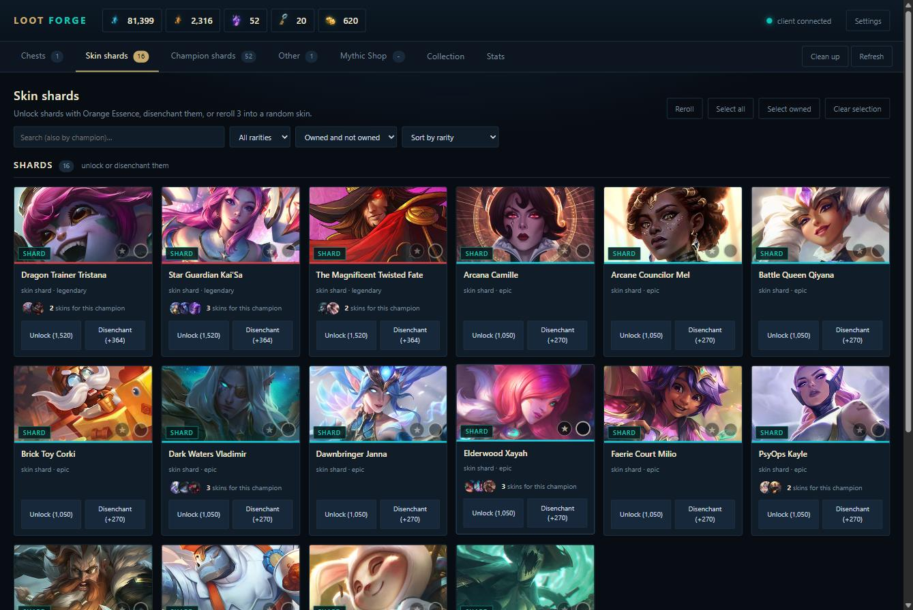
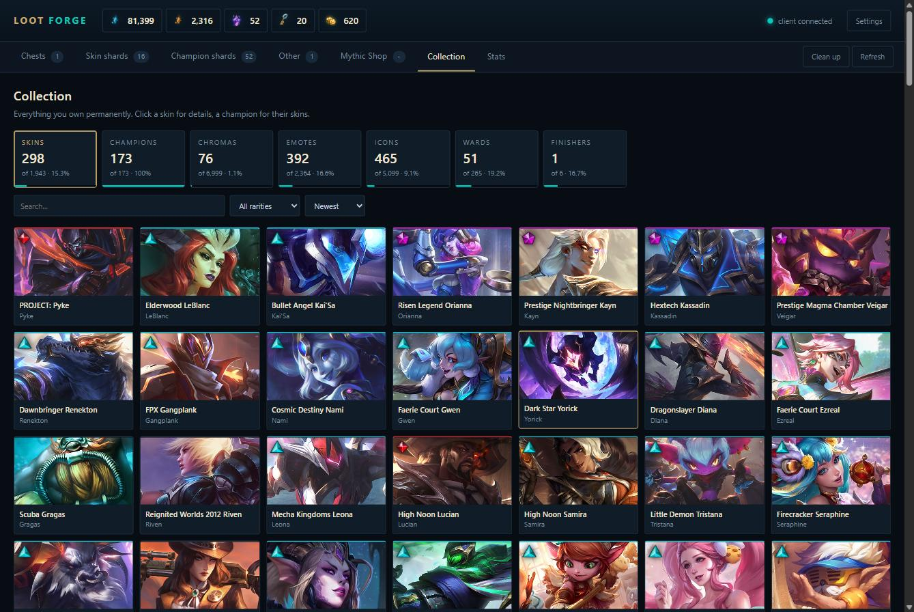
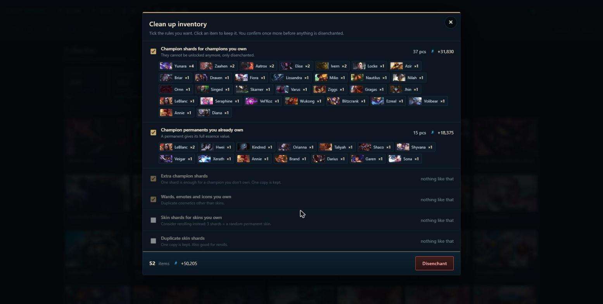
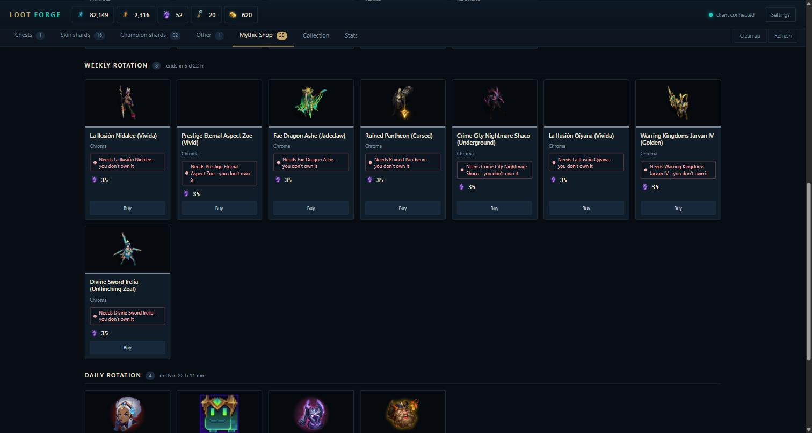
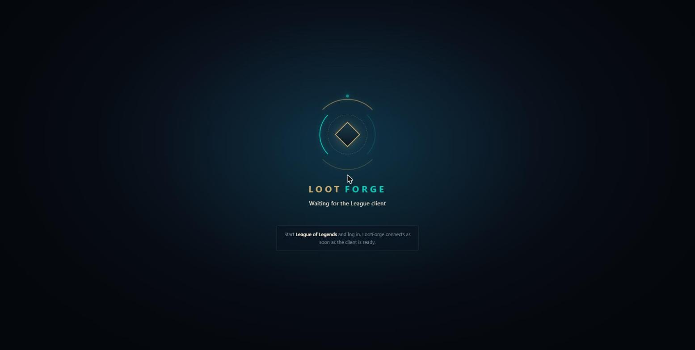

# LootForge

Open your League of Legends chests in bulk with cinematic, full-screen reveals.
Clean up your loot in one click and browse everything you own.

LootForge runs **on your own PC, next to the League client**. It shows your real
loot and does the same things as the client's loot screen, only faster and
nicer to watch. No build step, no dependencies and no Riot API key: just Node.js
and a browser.

> **Unofficial tool.** Everything LootForge does is real and happens on your
> actual account. See [Safety](#safety) and [Is this allowed?](#is-this-allowed)
> before you use it.



<table>
  <tr>
    <td width="50%"></td>
    <td width="50%"></td>
  </tr>
  <tr>
    <td>Every drop in one summary when a batch finishes.</td>
    <td>Full splash art, chromas and your other skins for that champion.</td>
  </tr>
  <tr>
    <td></td>
    <td></td>
  </tr>
  <tr>
    <td>Shards with search, filters and sorting.</td>
    <td>Your whole collection with completion percentages.</td>
  </tr>
  <tr>
    <td></td>
    <td></td>
  </tr>
  <tr>
    <td>Bulk disenchanting by rules, with everything listed before you confirm.</td>
    <td>The Mythic Shop tells you when a chroma is for a skin you don't own.</td>
  </tr>
  <tr>
    <td colspan="2"></td>
  </tr>
  <tr>
    <td colspan="2">LootForge waits for the client and connects on its own.</td>
  </tr>
</table>

## Features

| | |
|---|---|
| **Chests** | Open one, all of a kind, or everything at once. *Open all* shows its progress and can be stopped after the current batch. Keeps track of your keys and forges keys from fragments. |
| **Cinematic reveals** | You see the rarity first (official gem and colour), then the item. One chest gets a big roulette, 2–5 get stacked reels, 6+ get a card cascade. A summary of everything you got comes at the end. |
| **Unlock & reroll** | Unlocking plays a ceremony instead of a spin, because you already know what you get. Reroll puts three shards on an altar, spins them into a vortex and pulls a new skin out of a portal. |
| **Skin & champion shards** | Shards and permanents are grouped separately. Shards you already own get an *OWNED* ribbon. You can search, filter by rarity or ownership, and sort by essence value, count or name. |
| **Starred shards** | Star a shard to protect it: clean up, *Select all* and *Suggest 3* never take it, starred shards are listed first, and disenchanting one by hand warns you. |
| **Clean up** | Disenchant in bulk by rules: shards and permanents of champions you own, extra copies (one copy is always kept), duplicate wards, emotes and icons. Skin shards are off by default because rerolling them is usually better. Click an item to keep it. |
| **Skin details** | Full, uncropped splash art, chromas (owned ones are ticked, click one to see the model), your other skins for that champion and a video preview by SkinSpotlights. |
| **Mythic Shop** | Current rotations with images, rarity gems and countdowns. Click any skin or chroma to see its full splash art, and chromas say whether you own the skin they belong to - buying one without it is wasted essence. You can buy with Mythic Essence. |
| **Collection** | Everything you own: skins, champions, chromas, emotes, icons, wards and Nexus Finishers, with your completion percentage. |
| **Stats** | Chests opened, skin shards per chest, rarity distribution, essence gained and spent, rerolls, unlocks and a history. You can export them to JSON. |
| **Connection screen** | Waits for the League client with an animated emblem, tells you what to do if the client isn't running, and greets you by your Riot ID once it connects. It comes back if the client closes. |
| **Live updates** | Open a chest in the client and LootForge refreshes by itself. After a game it tells you what you got (*New loot: +1 Hextech Chest…*), and essence changes flash in the wallet. |
| **Remembers your view** | The last tab, filters, sorting and collection view survive a page reload (search text doesn't). |
| **Test items** | Optional simulated chest, shards and shop offer for trying out the animations. They never touch your account. Turn them on in *Settings*. |

Every irreversible action (disenchant, clean up, unlock, reroll, buy) goes
through a confirmation that tells you exactly what you will lose. The only
exception is opening chests, because that is the whole point of the app.

## Requirements

- **Windows** with the **League of Legends client** installed.
- Nothing else for `LootForge.exe`. Running from source needs
  [Node.js](https://nodejs.org/) 18 or newer.

## Getting started

1. Download **`LootForge.exe`** from the latest release. (The ZIP next to it is
   the same program with the README, licence and changelog alongside it.)
2. Start the League client and log in. You don't need to be in a game.
3. Double-click **`LootForge.exe`** (it needs no installation and writes nothing
   next to itself). Your browser opens LootForge at `http://127.0.0.1:4545`.

There is no console window. LootForge shows a connection screen until the
League client is ready (you can start the client later), and **quits by itself
about 30 seconds after you close its browser tab**. Double-clicking the exe again
while it runs just opens the tab. If something goes wrong, the log is in
`%LOCALAPPDATA%\LootForge\lootforge.log`.

> **"Windows protected your PC"?** The exe isn't code-signed (signing costs money
> every year), so SmartScreen warns about it on the first start. Click
> *More info → Run anyway*. If you'd rather not, run LootForge from source instead.

### Running from source

Clone the repository and double-click **`start.cmd`**, or run `npm start` /
`node server.js`. To use a different port: `set PORT=4546 && node server.js`.

### Updates

LootForge checks GitHub for a newer release at most twice a day and shows a
*vX.Y.Z available* button in the top bar. It never downloads or installs anything
by itself. You can turn the check off in *Settings*. See [CHANGELOG.md](CHANGELOG.md)
for what changed in each version.

### Controls

| | |
|---|---|
| `Esc` / `Space` | skip the running animation, then close the reveal |
| click the dark background | close the reveal, skin details or clean up |
| `Enter` / `Esc` | confirm / cancel a confirmation |
| **Fast** button | shorter animations for bulk opening |
| **Sound** button | mute the synthesized sound effects |

LootForge respects your system's *reduce motion* setting and starts in fast mode
when it is on.

## Video previews (optional YouTube key)

The *Video preview* button in skin details finds the skin's SkinSpotlights video.

- **Without a key**, it opens a YouTube search for the skin in a new tab.
- **With your own YouTube Data API key**, the video plays right inside LootForge.

To get a key:

1. Open the [Google Cloud Console](https://console.cloud.google.com/) and create a project.
2. Enable **YouTube Data API v3** for the project.
3. Go to *Credentials → Create credentials → API key*. Restricting the key to
   *YouTube Data API v3* is a good idea.
4. Paste the key into **Settings → Skin video previews**.

The free quota is 10,000 units a day. One search costs 100 units, so you get
about 100 searches a day. Found videos are cached for 30 days, so the same skin
doesn't cost quota twice.

LootForge never scrapes YouTube pages. Videos are embedded with the official
YouTube player (`youtube-nocookie.com`), so views count for the creator.

## Safety

- **Everything is real.** LootForge sends the League client the same requests its
  own loot screen sends (`POST /lol-loot/v1/recipes/{recipe}/craft`). Loot you
  open, disenchant or reroll is gone for good.
- **No cheats.** No injection, no memory reading, no changes to game files.
  LootForge is just a different front end for the client's local API.
- **It stays on your PC.** The server only listens on `127.0.0.1`, and the client's
  auth token never leaves your computer.
- **Other websites can't use it.** The server only accepts write requests from
  LootForge's own page (it checks `Host`, `Origin` and the content type). A random
  site open in your browser cannot disenchant your loot through it.
- **Mythic Shop purchases are experimental.** LootForge waits for the client to
  confirm the purchase and never reports success blindly. Still, double-check new
  purchases in the client.

## Is this allowed?

LootForge uses the **League Client API (LCU)**, the local API the client uses for
its own screens. Riot states that this API is *not officially supported* for
third-party apps and gives no guarantees that it stays stable. Many well-known
companion apps rely on it, but **you use LootForge at your own risk**. If Riot
changes the API, parts of the app can stop working until they are updated.

LootForge is free and will stay free. It contains no gambling features: it only
opens loot you already own, exactly as the client does.

## Privacy

LootForge has no accounts, no analytics and no telemetry.

- Your loot, stats, history and settings stay on your computer (in the browser's
  `localStorage` and in memory of the local server).
- Game images are loaded from your own League client. Nothing from Riot is
  redistributed with LootForge.
- The update check asks the public GitHub API for the latest LootForge release
  (at most twice a day, can be turned off in *Settings*). Only the request itself
  is sent: no data about you or your account.
- Other requests to the internet go to YouTube/Google, and only when you use
  video previews. With an API key, the skin name and your key are sent to the
  YouTube Data API. Google's
  [Privacy Policy](https://policies.google.com/privacy) and the
  [YouTube Terms of Service](https://www.youtube.com/t/terms) apply to those
  requests.

## Known limitations

- Windows only for now. The client discovery reads the `LeagueClientUx.exe`
  process and the Windows lockfile.
- Item names come from the client, so they follow your client's language.
- Drop weights of the simulated test chest are an estimate, not official Riot numbers.

## How it works

```
browser  ──/lcu/*──>  server.js  ──https + Basic auth──>  League client (LCU)
                          │
                          └── finds the port and token of the running client
```

The browser can't talk to the client directly: the client runs on a random port
with a self-signed certificate and a token only it knows. `server.js` finds those
credentials (the command line of `LeagueClientUx.exe`, with the lockfile as a
fallback) and proxies `/lcu/*`.

Recipes are never hard-coded. What can be done with an item comes from
`/lol-loot/v1/recipes/initial-item/{lootId}`, so new chest types work without
changes to the app.

## Development

```
node tests/run.js              all tests
node tests/run.js skiny css    only some (by file name)
```

The tests need no dependencies. They load the real front-end code in Node with a
small DOM stand-in, and **every write request is blocked**, so no test can ever
change your account. Tests that need a running client are skipped without one.
To point them at another server, use `LOOTFORGE_URL=http://127.0.0.1:4546`.

### Building the exe

```
npm run build
```

This creates `dist/LootForge.exe` (with the licence bundled inside, readable at
`/LICENSE` in the app) and `dist/LootForge-<version>-windows-x64.zip` with the
README, LICENSE and CHANGELOG alongside it. Attach both to a GitHub release. It uses Node's built-in
[single executable applications](https://nodejs.org/api/single-executable-applications.html)
(Node.js 20.12 or newer) and downloads the official `postject` tool through `npx`
during the build. LootForge itself still has no dependencies.

Releasing a new version: bump `version` in `package.json` and in the footer of
`public/index.html`, add a `CHANGELOG.md` entry, run the tests, run
`npm run build`, and attach the ZIP to a GitHub release tagged `vX.Y.Z`.

```
server.js        client discovery, LCU proxy, request guard, collection and shop summaries
start.cmd        Windows launcher (from source)
scripts/
  build-exe.js   builds LootForge.exe and the release ZIP
public/
  index.html     UI skeleton
  app.js         loot, recipes, crafting, reveals, filters, clean up, collection, stats, settings
  reel.js        roulette, cascade, unlock and reroll animations, synthesized sound
  simulator.js   optional test items (simulation only)
  app.css        styles
  reel.css       animation styles
tests/           test runner, harness and test files
```

Internal developer notes (in Czech) are in [`CLAUDE.md`](CLAUDE.md).

## Credits

- Skin video previews are made by [SkinSpotlights](https://www.youtube.com/channel/UC0NwzCHb8Fg89eTB5eYX17Q).
  All rights to the videos belong to their creators.
- Game art, names and icons belong to Riot Games and are loaded from your own
  League client.

## Legal

LootForge was created under Riot Games' "Legal Jibber Jabber" policy using assets
owned by Riot Games. Riot Games does not endorse or sponsor this project.

LootForge isn't endorsed by Riot Games and doesn't reflect the views or opinions
of Riot Games or anyone officially involved in producing or managing Riot Games
properties. Riot Games, and all associated properties are trademarks or
registered trademarks of Riot Games, Inc.

## License

[MIT](LICENSE)
